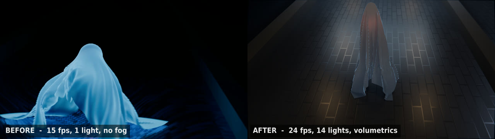

# Ghost Animation Using Cloth Physics in Blender

A cloth-simulation ghost drifting down a stone corridor. Built in Blender 4.2 for a
Computer Animation & Modeling final project at Kyungdong University.


This repository holds two versions. `Ghost.tar.xz` contains the original coursework
submission. `Ghost_v2.blend` is a rebuild, produced entirely by a script you can read and
re-run, with the reasoning behind every change measured and written up in
[docs/BREAKDOWN.md](docs/BREAKDOWN.md).

## Before and after



The original render is on the left. The corridor in it is not missing: walls, columns and
three floor sections were all modelled. They are invisible because every set surface was
`Metallic 1.0` over a near-black base colour, and a fully metallic surface has no diffuse
response at all, so it renders black no matter how much light you add. That single material
setting, not the lighting, is why the set never appeared.

| | Original | v2 |
|---|---|---|
| Frame rate | 15 fps | 24 fps |
| Length | 135 frames, 9.0 s | 336 frames, 14.0 s |
| Shots | 1 | 3, cut with camera markers |
| Cameras | 1 | 3, on rigs with Track To aim |
| F-curves / keyframes | 6 / 19 | 26 / 153 |
| Lights | 1 | 14 |
| Force fields | 0 | 2 (wind, turbulence) |
| Volumetrics | none | bounded Principled Volume |
| Compositor nodes | 0 | 10 |
| External files required | 2, both missing | 0 |
| Render engine | Cycles | EEVEE Next (Cycles is a one-word switch) |

## The film

`renders/ghost_v2.mp4` - 14 seconds, 1920x1080, 24 fps.


Three shots, cut with cameras bound to timeline markers.

### SH01 - the rise


The sheet settles for 48 frames before the shot starts, so the drape is finished rather than
still falling. The head stirs, holds for twelve frames (the beat where it notices you), then
rises with a small overshoot. The camera cranes up and swings out, which is the one piece of
animation kept from the original: it was already a three-channel move with a real arc.

### SH02 - the approach


The camera is now placed *ahead* of the ghost. The ghost keeps travelling in the same
direction, so screen direction is consistent, but it advances toward the lens and grows
instead of receding. In the original it travelled 50 units directly away from a camera
40 units out, which is why it shrank to a speck.

### SH03 - the ending


Wide and high, drifting back as the corridor empties.


`pin_stiffness` is keyframed from 1.0 to 0.0 over frames 348 to 362, so the fabric lets go
of the head. The head sinks through the floor while the sheet is left to slump onto the
stone. The original had no ending: its last keyframe was at frame 120 of 135 and the cloth
cache also stopped at 120, so the final ten frames were a frozen still, differing by a mean
pixel value of 0.01.

## Reproducing this from a clean clone

Nothing here depends on a file you have to go and find. The old version needed an HDR that
was never committed; v2 builds its sky procedurally instead.

```bash
git clone https://github.com/shemaiscard/Ghost-Animation-using-Blender.git
cd Ghost-Animation-using-Blender

# 0. unpack the original scene
tar -xJf Ghost.tar.xz

# 1. rebuild the v2 scene from it
blender -b Ghost.blend --factory-startup -P scripts/improve_ghost.py -- --out Ghost_v2.blend

# 2. bake the cloth (about 5 minutes; the cloth solver is CPU-only)
blender -b Ghost_v2.blend --factory-startup -P scripts/bake_cloth.py

# 3. generate the soundtrack
./scripts/make_audio.sh

# 4. render the PNG sequence and mux to mp4  (about 2 hours at 22 s/frame)
./scripts/render.sh

# optional: check the result
./scripts/verify_delivery.sh
```

Steps 0 and 1 are enough if you only want to open the file and look at it.

### Why EEVEE and not Cycles

The original rendered in Cycles. v2 defaults to EEVEE Next, and that is a hardware call
rather than a taste one. Measured on the machine this was rebuilt on, an i5-1240P laptop
with Intel integrated graphics and no CUDA or HIP device:

| Engine | Frame 130, 50% resolution, 48 samples | Extrapolated to 336 frames |
|---|---|---|
| Cycles | 537 s | about 50 hours |
| EEVEE Next | 5 s | about 30 minutes |

EEVEE Next in 4.2 handles volumetrics, soft shadows and screen-space raytracing, which is
everything this scene needs. If you have a GPU worth using, pass `--engine CYCLES` to
`improve_ghost.py`: samples, denoising and bounce limits are already configured.

## How the scene is built

**The ghost.** A UV sphere is the head and a cylinder is the body mass. Both are colliders
and both are hidden from the render: you never see them, they only push the cloth. A
102x102 subdivided plane (10,404 vertices) is the sheet, with a Cloth modifier on the
Angular bending model.

A feathered vertex group called `PIN` holds the crown of the sheet to the head at weight
1.0, falling to 0.45 and then 0.12 further out so the pin does not end in a hard creasing
ring. The original file contained **no vertex groups at all**, so nothing attached the sheet
to the ghost: the head was simply shoving it along.

**The rig.** An empty called `GHOST_ROOT` carries the performance, and both the head and
the cloth are parented to it. This matters: if the cloth were parented to the head directly,
every scale keyframe on the head would also scale the fabric, inflating it on the rise and
shrinking it away at the end instead of dropping it.

**The corridor.** Walls, columns and floor are planes and cubes driven by Array modifiers.
They are colliders too, so the hem drags along the ground. All six colliders were at Cloth
Friction 80.0 in the original, the maximum the field allows against a default of 5.0, which
glued the hem to the floor and tore the sheet off the head whenever it accelerated.

**Motion.** A Noise F-modifier on the root's Z location adds a slow bob, restricted to
frames 49 to 344 with blend-in and blend-out so it is not fighting the ending. Wind and
Turbulence force fields, both distance-limited, give the fabric drift instead of just fall.

**Light.** A Sun is the moon, an Area behind the ghost is the rim that separates it from the
black, ten warm Points are corridor practicals, a wide Area is bounce fill, and the
original's red lamp survives inside the sheet as a dimmer ember. A bounded cube with a
Principled Volume puts fog in the corridor so the light has something to catch on.

**The camera.** Three cameras, each parented to a rig empty carrying a Track To constraint
aimed at the ghost. The rig decides where the camera looks; the camera itself only carries a
small Noise-driven handheld drift. Binding a camera to a timeline marker is how you cut
inside a single Blender scene: select the marker, select the camera, `Ctrl+B`.

## Scripts

| Script | What it does |
|---|---|
| `scripts/improve_ghost.py` | Rebuilds `Ghost_v2.blend` from the original. Every change is commented with the measured "before" value. |
| `scripts/bake_cloth.py` | Bakes the cloth cache to disk. Documents two headless-Blender traps that make a bake silently do nothing. |
| `scripts/make_audio.sh` | Synthesises the soundtrack with ffmpeg. No third-party audio. |
| `scripts/render.sh` | Renders the PNG sequence and muxes it with the audio. |
| `scripts/verify_delivery.sh` | Checks the finished render and the repo, writes `docs/RENDER_REPORT.md`. |

## Repository layout

```
Ghost.tar.xz        the original coursework .blend, as submitted (24 MB)
Ghost video.mp4     the original render, 9 s at 15 fps
Ghost_v2.blend      the rebuilt scene (546 KB, no packed externals)
renders/            ghost_v2.mp4 (the PNG sequence is gitignored)
assets/audio/       generated soundtrack
scripts/            the five scripts that rebuild everything
docs/               breakdown, verification report, README images
```

`Ghost_v2.blend` is 546 KB where the original is 47 MB. That is not compression: the
original carried a dead image reference and a saved render result, and was stored with the
full editor UI state. Git LFS was considered and deliberately not used; the reasoning is
written into `.gitattributes`.

## Requirements

- Blender 4.2 LTS (developed against 4.2.9)
- ffmpeg, for the soundtrack and the final mux
- Any machine that can run EEVEE. The cloth solver is CPU-only regardless of engine.

## Licensing

Scripts are MIT. Scene files and renders are CC BY 4.0. There are no third-party art assets:
the environment is procedural and the audio is synthesised. See [ASSETS.md](ASSETS.md) for
the full breakdown, including what was removed from the first version and why.

## Credits

Shema Nkindi Giscard, Student ID 2217151, Smart Computing Group 1, Kyungdong University.
Computer Animation & Modeling.
