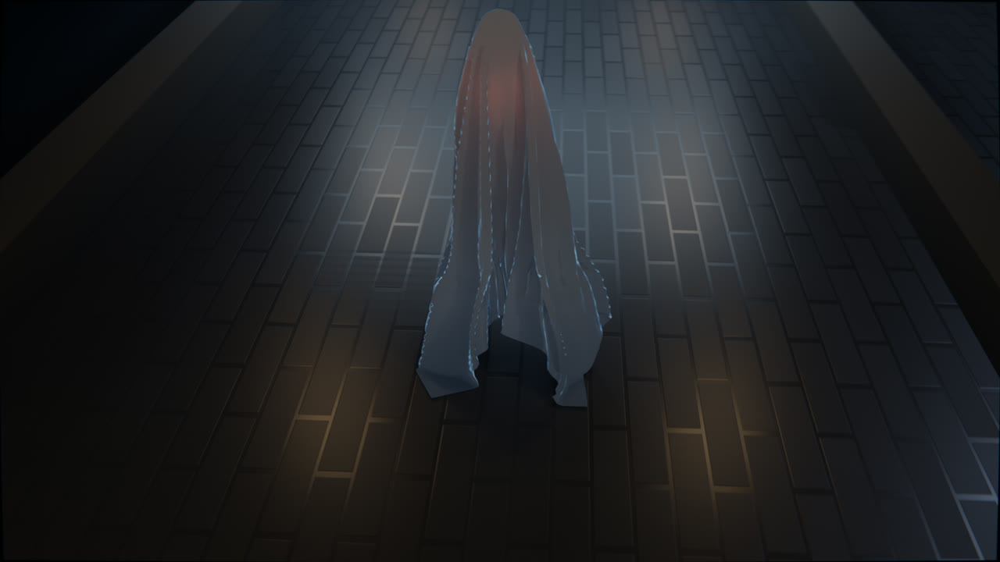
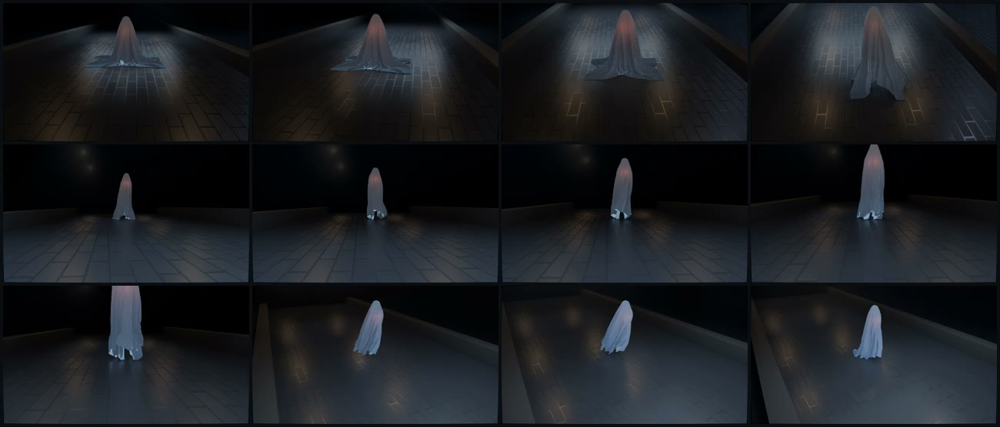
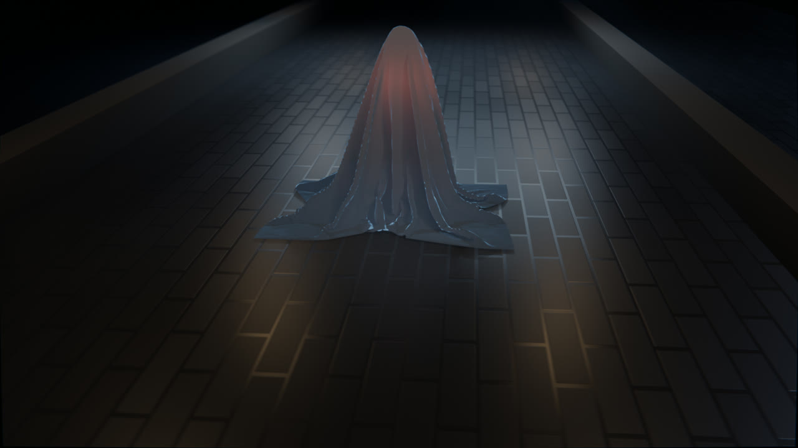
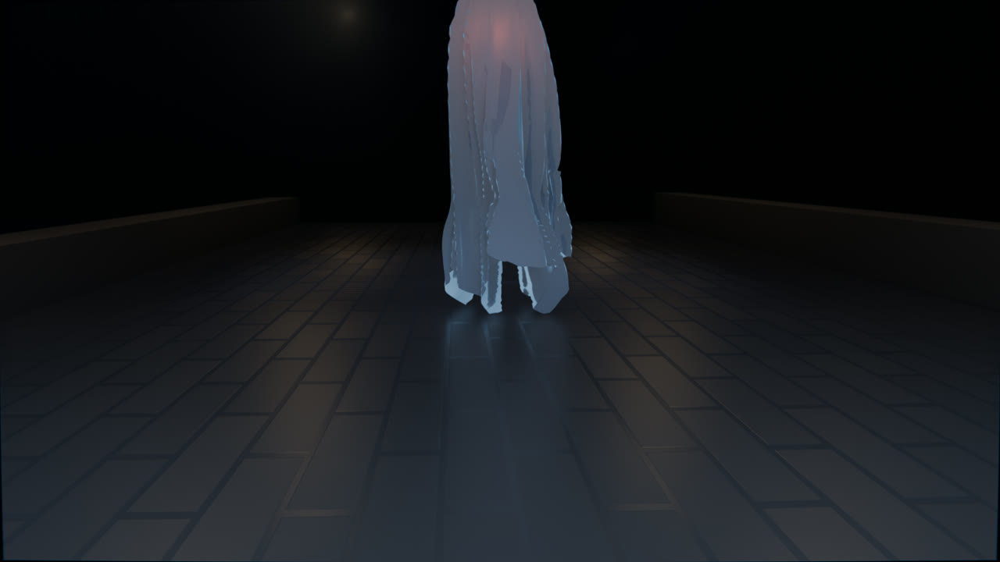
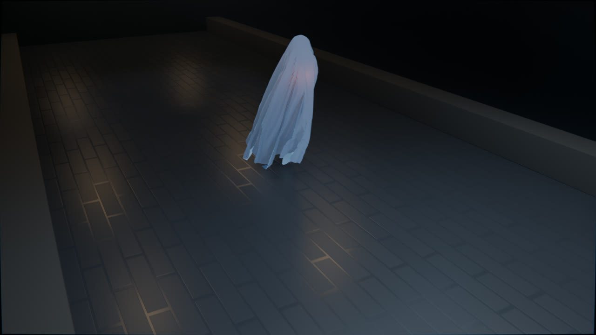
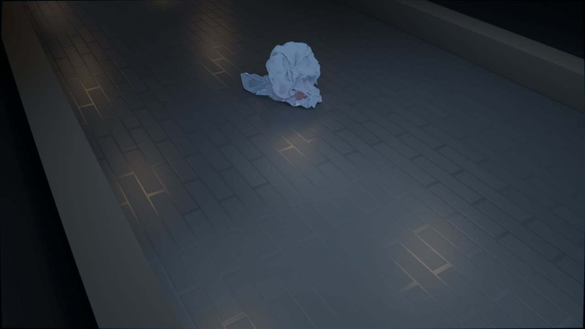

# Ghost Animation Using Cloth Physics in Blender

A cloth-simulation ghost drifting down a stone corridor. Fourteen seconds, three shots,
1920x1080 at 24 fps, built in Blender 4.2 for a Computer Animation & Modeling project at
Kyungdong University.



The whole piece is driven by a single cloth simulation. There is no character model and no
rigged figure: a hidden sphere and cylinder push a 102x102 sheet around, and everything the
viewer reads as a ghost, the hood, the shoulders, the trailing hem, is the fabric solving
against those colliders.

## The film

`renders/ghost.mp4`



Three shots, cut with cameras bound to timeline markers.

### SH01: the rise



The sheet is given 48 frames to settle before the shot starts, so the drape has finished
falling by the time the camera sees it. The head stirs, holds for twelve frames, then rises
with a small overshoot. The camera cranes up and swings out across the move.

### SH02: the approach



The camera sits ahead of the ghost and lets it come to the lens. The ghost keeps travelling
in the same direction as the previous shot, so screen direction stays consistent, but the
figure grows through the shot instead of receding.

### SH03: the ending



Wide and high, drifting back as the corridor empties.



`pin_stiffness` is keyframed from 1.0 to 0.0 over frames 348 to 362, so the fabric lets go of
the head. The head sinks through the floor while the sheet is left to slump onto the stone.

## How the scene is built

**The ghost.** A UV sphere is the head and a cylinder is the body mass. Both are colliders
and both are hidden from the render: you never see them, they only push the cloth. A 102x102
subdivided plane (10,404 vertices) is the sheet, with a Cloth modifier on the Angular bending
model, 12 quality steps and collision quality 6.

A feathered vertex group called `PIN` holds the crown of the sheet to the head at weight 1.0,
falling to 0.45 and then 0.12 further out, so the pin does not end in a hard creasing ring.
Without the feathering you get a visible seam where pinned and free vertices meet.

**The rig.** An empty called `GHOST_ROOT` carries the performance, and both the head and the
cloth are parented to it. This matters: if the cloth were parented to the head directly, every
scale keyframe on the head would also scale the fabric, inflating it on the rise and shrinking
it away at the end instead of dropping it.

**The corridor.** Walls, columns and floor are planes and cubes driven by Array modifiers.
They are colliders too, so the hem drags along the ground. Collider friction is deliberately
low on the floor sections (3.0) and higher on the body (16.0): a high-friction floor glues the
hem down and tears the sheet off the head whenever it accelerates.

**Motion.** A Noise F-modifier on the root's Z location adds a slow bob, restricted to frames
49 to 344 with blend-in and blend-out so it is not fighting the ending. Wind and Turbulence
force fields, both distance-limited, give the fabric drift instead of just fall.

**Light.** A Sun is the moon, an Area behind the ghost is the rim that separates it from the
black, ten warm Points are corridor practicals, a wide Area is bounce fill, and a dim red
point lamp sits inside the sheet as an ember. Fourteen lights in total. A bounded cube with a
Principled Volume puts fog in the corridor so the light has something to catch on.

The set materials are all non-metallic. That is worth stating because it is the easiest thing
to get wrong here: a surface at `Metallic 1.0` has no diffuse response at all, so over a dark
base colour it renders black no matter how much light you point at it, and the corridor
disappears.

**The camera.** Three cameras, each parented to a rig empty carrying a Track To constraint
aimed at the ghost. The rig decides where the camera looks; the camera itself only carries a
small Noise-driven handheld drift. Binding a camera to a timeline marker is how you cut inside
a single Blender scene: select the marker, select the camera, `Ctrl+B`.

**Sound.** The soundtrack is synthesised from oscillators and filtered noise by
`scripts/make_audio.sh`: a pair of detuned sines beating against each other, brown noise for
the floor, band-passed pink noise for corridor air, and decaying sub bursts placed on the
picture beats. No third-party audio, so nothing to license.

## Rendering it yourself

The scene has no external dependencies. The sky is procedural, the audio is generated, and
nothing needs to be downloaded or relinked.

```bash
git clone https://github.com/shemaiscard/Ghost-Animation-using-Blender.git
cd Ghost-Animation-using-Blender

# bake the cloth (about 5 minutes; the cloth solver is CPU-only)
blender -b Ghost.blend --factory-startup -P scripts/bake_cloth.py

# generate the soundtrack
./scripts/make_audio.sh

# render the PNG sequence and mux to mp4 (about 2 hours at 22 s/frame)
./scripts/render.sh

# optional: check the result
./scripts/verify_delivery.sh
```

To just look at the scene, open `Ghost.blend`. The cloth will need a bake before it moves.

### Engine

The scene renders in EEVEE Next. That is a hardware call: measured on an i5-1240P laptop with
Intel integrated graphics and no CUDA or HIP device, a single Cycles frame at half resolution
and 48 samples took 537 seconds, against 5 seconds for the same frame in EEVEE. That is about
50 hours versus 30 minutes for the film. EEVEE Next in 4.2 handles the volumetrics, soft
shadows and screen-space raytracing this scene needs.

Cycles settings (samples, OpenImageDenoise, bounce limits) are still configured in the file,
so switching engines is a one-field change if you have a GPU worth using.

## Scripts

| Script | What it does |
|---|---|
| `scripts/bake_cloth.py` | Bakes the cloth cache to disk. Documents two headless-Blender traps that make a bake silently do nothing. |
| `scripts/make_audio.sh` | Synthesises the soundtrack with ffmpeg. |
| `scripts/render.sh` | Renders the PNG sequence and muxes it with the audio. |
| `scripts/verify_delivery.sh` | Checks the finished render and the repository. |
| `scripts/archive/build_scene.py` | The script that assembled this scene. Kept for reference; it is not part of the render pipeline. |

Two things in `bake_cloth.py` are worth knowing if you bake Blender scenes headlessly:
`bpy.ops.ptcache.bake()` silently does nothing in background mode, and a cache flagged
`is_baked` will be served even when it holds no data, so every frame comes back identical
until you free it. Both are handled and commented in the file.

## Repository layout

```
Ghost.blend         the scene, 546 KB, nothing external to relink
renders/ghost.mp4   the finished film
assets/audio/       generated soundtrack
scripts/            bake, audio, render, verify
docs/images/        stills used in this README
```

The PNG sequence and the cloth cache are both regenerable and both gitignored: together they
run to about a gigabyte. Git LFS was considered and deliberately not used; the reasoning is
written into `.gitattributes`.

## Requirements

- Blender 4.2 LTS (developed against 4.2.9)
- ffmpeg, for the soundtrack and the final mux
- Any machine that can run EEVEE. The cloth solver is CPU-only regardless of engine.

## Licensing

Scripts are MIT. The scene file and the render are CC BY 4.0. There are no third-party art
assets: the environment is procedural and the audio is synthesised. See [ASSETS.md](ASSETS.md).

## Credits

Shema Nkindi Giscard, Student ID 2217151, Smart Computing Group 1, Kyungdong University.
Computer Animation & Modeling.
